We gaan kunst maken met Python Turtle.

<!--more-->

## Introductie

We gebruiken voor deze instructies Thonny, een eenvoudige editor voor Python scripts.  
Je kunt deze [hier](https://thonny.org/) downloaden en vervolgens installeren.

Mocht je nog geen ervaring hebben met Thonny en Turtle, kijk dan ook eens naar onze 
[Python Turtle](/instructies/python-turtle/) instructies.

Je kunt ook kunst maken met Scratch. Kijk daarvoor naar de [Scratch Art](/instructies/scratch-art/) instructies.

In deze instructie behandelen we kunst met lijnen, cirkels, polygonen (zoals een driehoek en vierkant) en een lissajous.

## Lijnen

We beginnen eenvoudig met het tekenen van een enkele lijn:


from turtle import *

forward(100)

done()


Op regel 1 wordt Turtle geladen. Deze regel is nodig om de Turtle commando's te kunnen gebruiken.  
Op de 3e regel wordt met Turtle commando `forward` een lijn getrokken met lengte 100.  
Tenslotte zorgt `done` op regel 5 er voor dat het scherm waarop getekend is, open blijft.

**Opdracht 1**: Verander de lengte eens en kijk wat er gebeurd.  
**Opdracht 2**: Maak de lengte eens negatief. Waar gaat de lijn heen?

## Polygonen

Een andere naam voor een polygoon is een veelhoek. Voorbeelden van eenvoudige veelhoeken zijn een driehoek, vierkant en
vijfhoek.

### Een driehoek
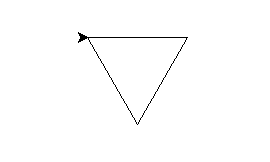

Met drie lijnen kun je een driehoek tekenen. Dit kan er als volgt uit zien:


from turtle import *

forward(100)
right(120)
forward(100)
right(120)
forward(100)
right(120)

done()


Het commando `right` op regels 4, 6 en 8 zorgt ervoor dat de pen naar rechts draait en wel met 120 graden.

**Opdracht 3**: Voeg regels 3 tot en met 8 eens stap voor stap toe en zie wat elke stap doet.

### Herhalingen

In het vorige voorbeeld zag je 3 keer een herhaling van een `forward` en `right` command. Dit kun je ook met een
herhaling beschrijven in Python:


from turtle import *

for i in range(3):
    forward(100)
    right(120)

done()


Op regel 3 zorgt command `for i in range(3)` ervoor dat regels 4 en 5 driemaal herhaald worden.

**Opdracht 4**: Verander de range (het getal 3) eens naar 1, 2, 3 of 4? Wat gebeurd er?  
**Opdracht 5**: Maak de hoek (het getal 120) eens groter of kleiner en kijk wat er gebeurd.

### Functie

Je hebt over herhalingen geleerd. Je kunt herhalingen nog makkelijker maken door een functie te gebruiken.  
Een functie is een stukje code met een naam. Verder kun je wat getallen meegeven om het gedrag van de functie aan te
passen.

Hier een voorbeeld van de code:


from turtle import *

def vorm(x, y, rib, hoeken, rotatie=0):
    goto(x, y)
    right(rotatie)
    pendown()
    for _ in range(hoeken):
        forward(rib)
        right(180 - ((hoeken - 2) * 180 / hoeken))
    penup()
    right(-rotatie)

vorm(0, 0, 100, 4, 45)
vorm(30, 300, 80, 5, 60)

done()


Je hoeft niet te weten hoe een functie misschien werkt, maar wel hoe je het moet gebruiken.

Functie `vorm` heeft de volgende parameters:
* **x**: de horizontale plek in het plaatje. 0 is in het midden. - getallen is naar links en + getallen naar rechts.
* **y**: de vertikale plek in het plaatje. 0 is in het midden. - getallen zijn naar beneden en + getallen naar boven.
* **rib**: een vierkant bestaat uit vier lijnen. Deze lijnen heten ribben. Parameter `rib` is een getal groter dan 0
    dat bepaald hoe groot een vierkant is.
* **hoeken**: een driehoek heeft 3 hoeken (duh!). Met parameter `hoeken` kun je aangeven hoeveel hoeken je veelhoek
    moet hebben.
* **rotatie**: normaal wordt een vierkant recht getekend, ofwel de onderste rib staat helemaal horizontaal. Met
    parameter `rotatie` kun je het vierkant kantelen. 

Op regels 15 en 16 staan voorbeelden van het gebruik van de functie `vorm`. De eerste is een vierkant midden in het
plaatje. Het tweede een gekantelde vijfhoek boven in het plaatje.

**Opdracht 6**: Maak eens een achthoek met een rib van 120.  
**Opdracht 7**: Herhaal de aanroep van de `vorm` functie eens een paar keer met iedere keer een andere vorm.

Je kunt de polygonen ook inkleuren:


from turtle import *

def vorm(x, y, rib, hoeken, rotatie=0):
    goto(x, y)
    right(rotatie)
    pendown()
    for _ in range(hoeken):
        forward(rib)
        right(180 - ((hoeken - 2) * 180 / hoeken))
    penup()
    right(-rotatie)

vorm(0, 0, 120, 8, 45)

fillcolor("red")
begin_fill()
vorm(-19, -46, 80, 8, 45)
end_fill()
goto(-120, -175)
color("white")
write("STOP", font=('Arial', 36, 'bold'))
hideturtle()
done()


Voor het inkleuren van de figuur gaat het eigenlijk alleen maar om regels 17, 18 en 20.  
Met `fillcolor` kies je de kleur. Na `begin_fill` wordt een volgend figuur dat getekend wordt ingekleurd. Om te voorkomen
dat een daarop volgend figuur wordt ingekleurd, gebruik je `end_fill`.

**Opdracht 8**: Neem de code over en voer het uit. Er zit een verrassing in! 😉

## Cirkels

Naast rechte lijnen, kun je met Turtle ook cirkels tekenen. Daarvoor is het commando `circle`:


from turtle import *

circle(100)

done()


Het getal 100 op lijn 3 staat voor de diameter van de cirkel. 

**Opdracht 9**: Maak de cirkel eens groter.

Als je cirkels combineert met herhalingen en draaingen, dan kun je mooie figuren als deze maken:

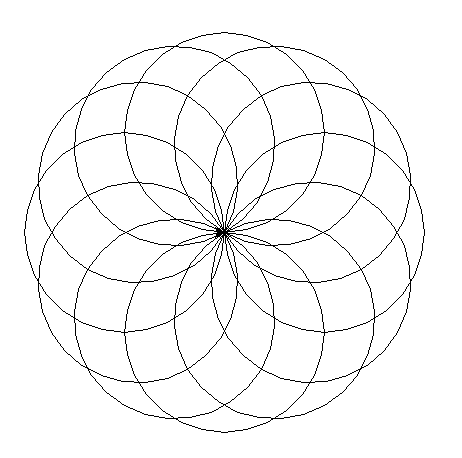

De code die hierbij hoort, is:


from turtle import *

for i in range(12):
    circle(100)
    right(30)

done()


Door met het aantal (getal 12) en de hoek tussen de cirkels (getal 30) te spelen, kun je het figuur er anders uit 
laten zien.

**Opdracht 10**: Als je de hoek kleiner maakt, bijvoorbeeld naar 20, heb je dan genoeg cirkels om het figuur helemaal 
    rond te maken? Welk getal moet je aanpassen om het figuur weer compleet te krijgen? Moet het groter of kleiner
    worden?

Door met kleuren te spelen, wordt het figuur nog mooier:


from turtle import *

kleuren = ["red", "cyan", "green", "yellow", "purple", "orange", "blue"]
bgcolor("black")

for i in range(12):
    color(kleuren[i % 7])
    circle(100)
    right(30)

done()


Op regel 3 worden de kleuren die we willen gebruiken in een lijstje gezet. Je kunt niet zomaar elke kleur gebruiken en
Python snapt geen Nederlands. Voor een overzicht van de kleuren die mogelijk zijn, kun je even kijken naar onze [Python
Turtle instructies](/instructies/python-turtle/#kleuren-overzicht).  
Op regel 4 maken we de achtergrond zwart. Hierdoor komen de kleuren in het lijstje beter uit.  
Op regel 7 wordt een kleur gekozen uit het lijstje en geactiveerd.

**Opdracht 11**: Neem de code over en kies eens wat andere kleuren. Je kunt ook het lijstje kort of langer maken, maar 
dan moet het getal 7 op regel 7 aangepast worden, zodat het gelijk is aan het aantal kleuren in de lijst.

## Lissajous

Met lijnen, polygonen en cirkels kun je al mooie plaatjes maken. Met een 
[Lissajous](https://nl.wikipedia.org/wiki/Lissajousfiguur) wordt het nóg interessanter. 

Met een wiskundige formule worden twee golven gecombineerd:

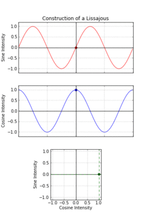

### Sinus

Allereerst tekenen we een sinus-golf:

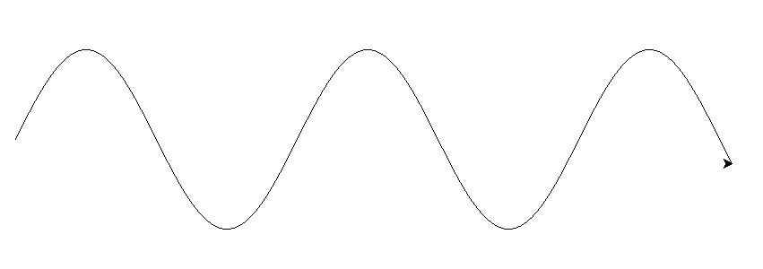

Met deze code:


from turtle import *
from math import sin

penup()
goto(-400, 0)
pendown()
for i in range(-400, 400):
    goto(i, 100 * sin((i + 400) / 50))

done()


Het commando `sin` zorgt hier voor de golfvorm. Afhankelijk van het getal dat je als parameter mee geeft, gaat de golf
sneller of langzamer.

**Opdracht 12**: Vervang getal 50 op regel 8 eens door een groter of kleiner getal. Wat gebeurt er?
**Opdracht 13**: Vervang getal 100 op regel 8 eens door een groter of kleiner getal. Wat gebeurt er?

### Lissajous

Als we twee sinussen in één formule combineren, dan kun je een Lissajous tekenen. Kijk eens naar de volgende code:


from turtle import *
from math import sin

a = 4
b = 3
x = 0
y = 0
s = 300

for i in range(1000):
    goto(s * sin(x/150), s * sin(y/150))
    x += a
    y += b

done()


**Let op: zorg dat je regel 2 overneemt, anders wordt het `sinus` commando niet herkend.**

Op regel 11 zie je de combinatie van twee sinussen in het `goto` commando. Met dit commando verschuif je de pen
over het plaatje. Met de eerste parameter horizontaal en met de tweede verticaal. Door voor beiden een sinus te 
gebruiken, schuift de pen zowel horizontaal en verticaal.

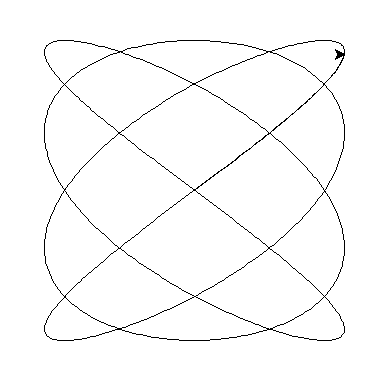

**Opdracht 13**: Neem de code over en voer het uit. Zie je hetzelfde plaatje als hierboven?  
**Opdracht 14**: Maak de waarde voor s (regel 8) eens kleiner? Wat gebeurt er? En als je het groter maakt?  
**Opdracht 15**: Variabelen _a_ en _b_ bepalen de vorm van de Lissajous. Probeer eens andere waarden, zoals bijvoorbeeld
    _a_ = 18 en _b_ = 19. Hoe ziet dat er uit?

## Tot slot

Zoals je ziet kun je met Python Turtle leuke kunststukjes maken. Gebruik je fantasie, maar vooral durf te proberen met
diverse getallen. Wie weet wat je kunt maken?

Ter voorbereiding van deze instructie hebben we zelf ook wat kunst gemaakt. Probeer ze eens uit:
 * [art-1.py](art-1.py) gekleurde lijnen  
    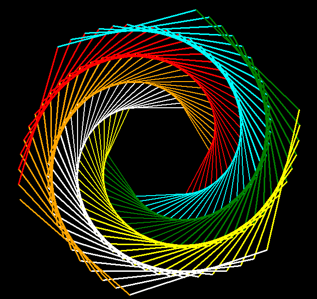
 * [art-2.py](art-2.py) gekleurde lijnen  
   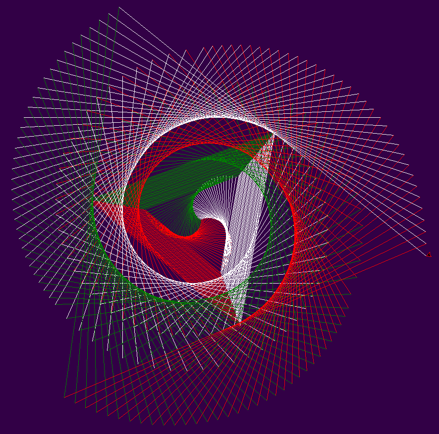
 * [art-3.py](art-3.py) gekleurde lijnen  
   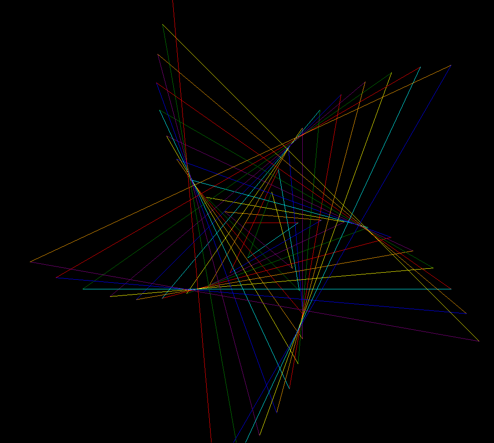
 * [art-4.py](art-4.py) gekleurde cirkels  
   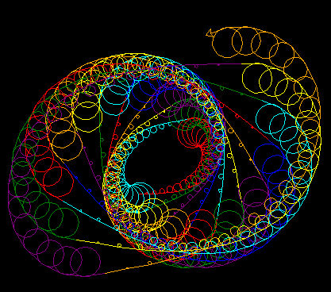
 * [art-5.py](art-5.py) gekleurde veelhoeken  
   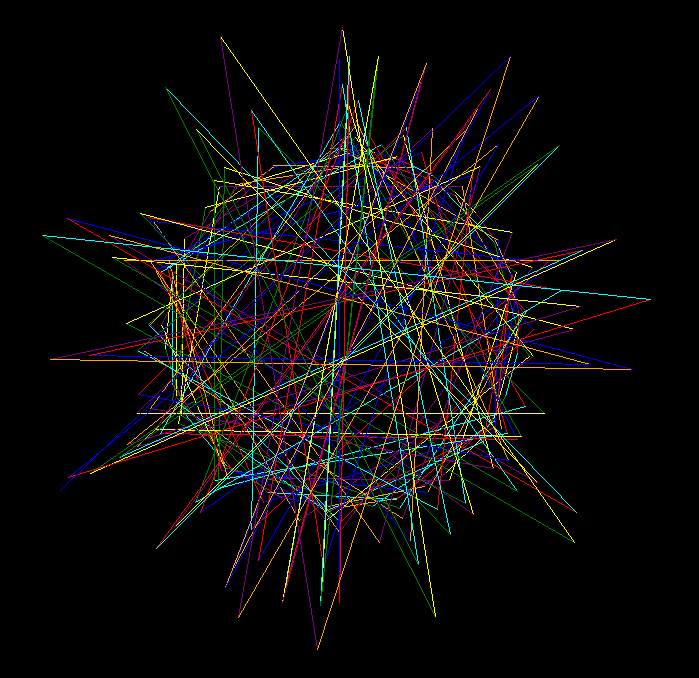
 * [art-6.py](art-6.py) gekleurde en gedraaide vierkanten  
   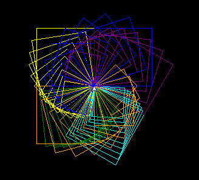
 * [art-7.py](art-7.py) lissajous  
   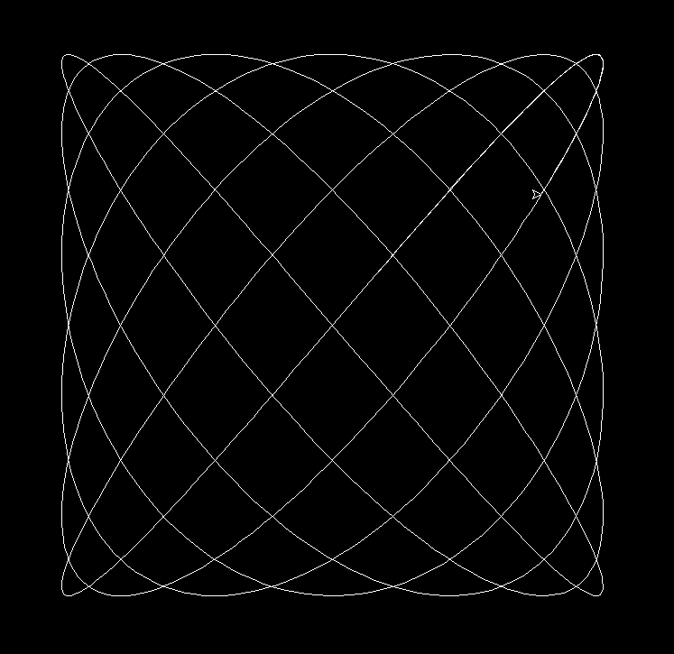
 * [art-8.py](art-8.py) willekeurige gekleurde vijf- en zevenhoeken  
   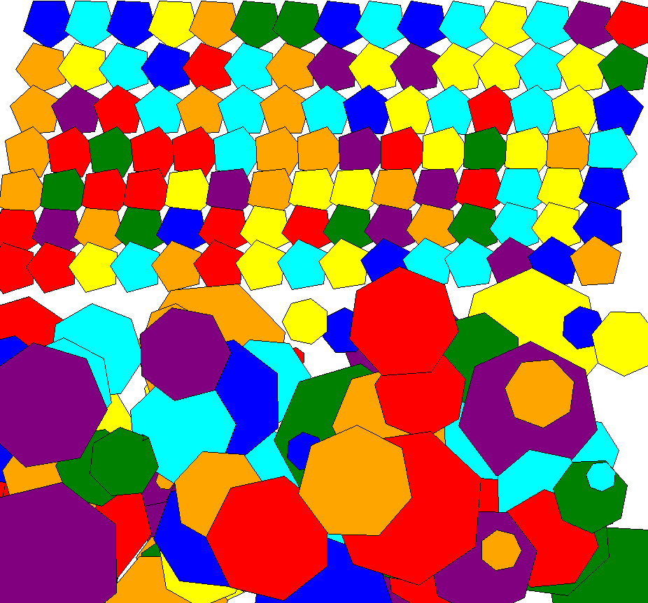
 * [art-9.py](art-9.py) willekeurig gekleurde gedraaide negenhoeken  
   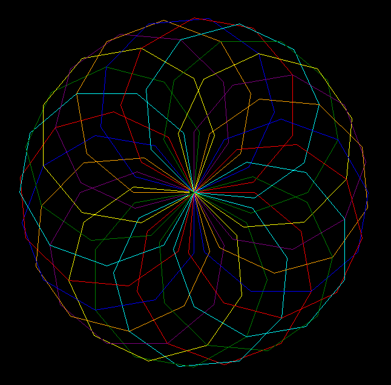

